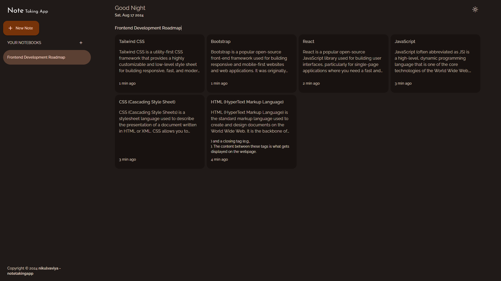
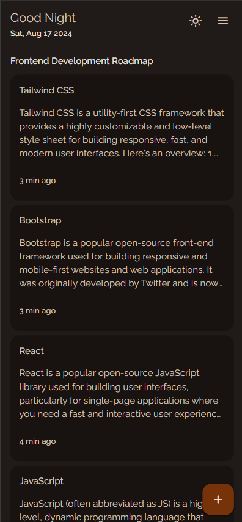
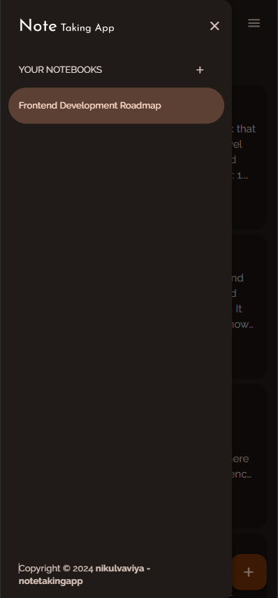
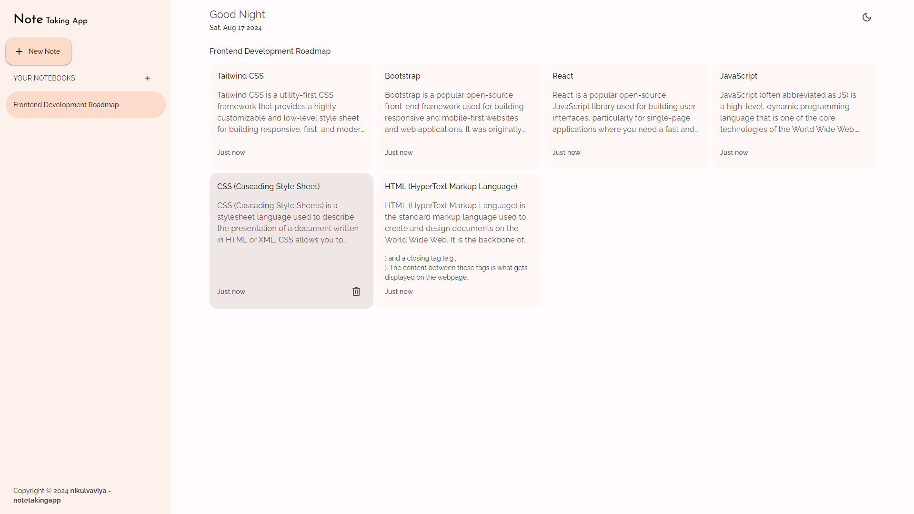

# Note Taking App

**Note Taking App** is a responsive web application that allows users to create, read, update, and delete (CRUD) notes. This application is designed with simplicity and user-friendliness in mind, featuring both light and dark themes to enhance the user experience. The app is built using HTML, CSS, and JavaScript.

## Features

- **Create, Read, Update, Delete (CRUD) Functionality**: Users can effortlessly create new notes, view existing notes, update content, or delete notes they no longer need.
- **Responsive Design**: The app is fully responsive, ensuring a seamless experience across all devices, from mobile phones to desktops.
- **Theme Toggle**: Users can switch between dark and light themes according to their preference.
- **Persistent Storage**: Notes are stored locally in the user's browser, ensuring that they are available even after the page is refreshed.

## Screenshots

### Light Theme

### Dark Theme

## Technologies Used

- **HTML**: For the basic structure and layout of the app.
- **CSS**: For styling and responsive design.
- **JavaScript**: For interactivity and managing the CRUD operations.

## How It Works

1. **Create a Note**: Users can add a new note by entering a title and content in the provided fields and clicking the "Add Note" button.
2. **View Notes**: All saved notes are displayed in a list format, with the title and a snippet of the content.
3. **Update a Note**: Clicking on a note allows users to update the content. Changes can be saved by clicking the "Save" button.
4. **Delete a Note**: Users can delete any note by clicking the "Delete" button associated with the note.

## User Interface

The user interface is designed to be intuitive and clean, with clear visual cues to guide users through their tasks. The theme toggle switch is easily accessible, allowing users to switch between themes instantly.

## Code Structure

- **index.html**: The main HTML file that contains the structure of the app.
- **styles.css**: The CSS file that handles the styling, including responsiveness and theme settings.
- **app.js**: The JavaScript file that manages the app's interactivity, including CRUD operations and theme switching.

---

Thank you for checking out **Note Taking App**! If you have any feedback or suggestions, feel free to reach out. Happy coding!

